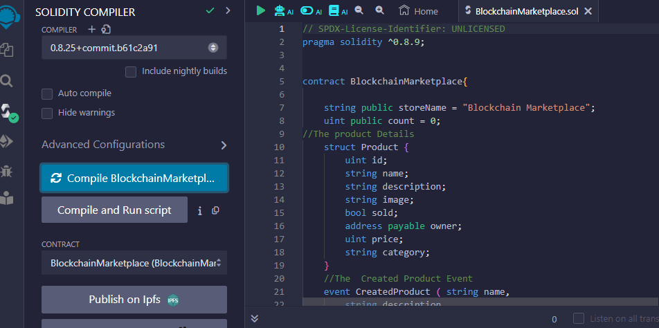
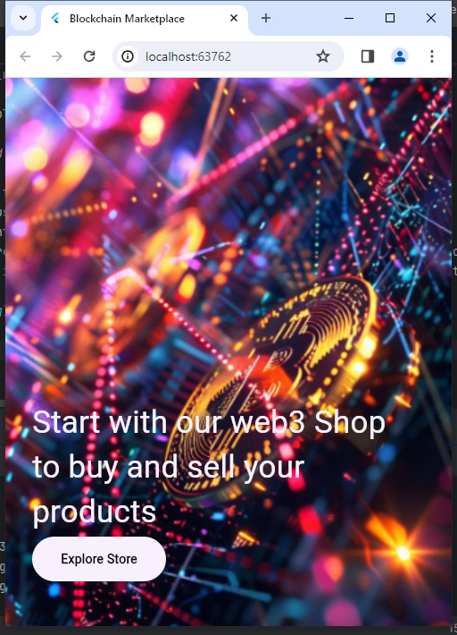

### Hi there 👋, WOO TEAM
#### WEB3 E-Commences Stores
![WEB3 E-Commences Stores]

     Welcome to the future of online shopping — where decentralization meets commerce in the vibrant realm of Web3. At WOO , we're ushering in a new era of digital trade, where empowerment, transparency, and innovation converge to redefine the way we buy and sell.
  In a world where trust is paramount and intermediaries often wield undue influence, Web3 emerges as a beacon of autonomy and reliability. Imagine a marketplace where transactions are not just transactions, but interactions — direct, peer-to-peer connections between buyers and sellers, unencumbered by middlemen or centralized control.

  So, whether you're a seasoned crypto enthusiast, a curious newcomer, or simply someone who believes in a better way forward, we invite you to join us on this exhilarating journey into the heart of Web3 commerce. Together, let's reshape the future of shopping — one decentralized transaction at a time.

Welcome to WOO , where the future of e-commerce is no

# encode_scalling_web3_mobiledapp

Blockchain Marketplace

## Getting Started

The first step is to deploy the smart contract. 
This can be done using the Remix online IDE or by using a local IDE and Hardhat. 
Once the deployment is successful, the requirements for integrating the interface using the Flutter framework are: contract address, ABI script, bytecode & deployedBytecode.
The next steps, create a new Flutter project and build the UI, models, and functions based on the functions used from the smart contract.
An Infura account is needed to access the blockchain network; This project using the Sepolia network. Then, a Pinata account & IPFS is required for image upload.

